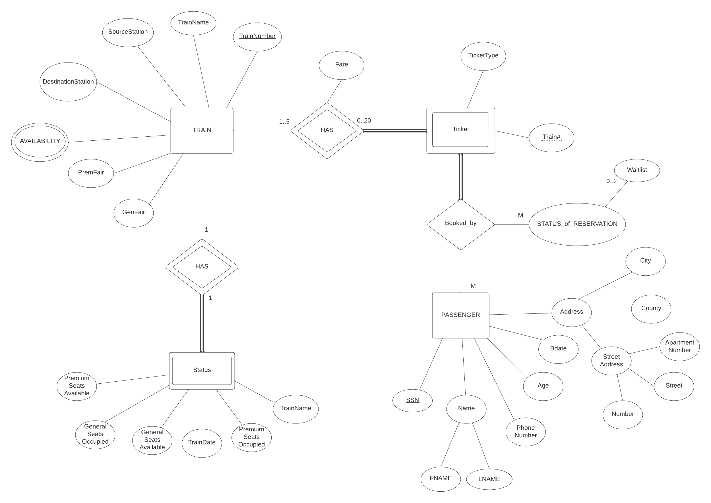

# Train Resevation System

## Project Description

    A company requested our team to construct a SQL database system to track and store data for their various passenger trains. This data not only includes information about the trains themslves but also the passengers and their ticket or booking. The requirements ask that the system can handle up to five trains with two ticket types, General and Premium, with a max of 10 ticket for each type per train. Also including a status for the passengers to see, wheather they are booked or in the waitlist, which has a maximum size of 2. Part 1 of the project requires a Entity Relationship Diagram (ER Diagram), and Part 2 involes the SQL create tables, inserting of data, and specific queries.

## Team Members:

    Trenton Laule		Joel Guerra

## Entity Relationship (ER) Diagram

## Tools

Tools used in creationof this project include:

* Lucidcharts
* Visual Studio Code
* SQLite 3
* Ubuntu WSL (version 22.04.2)

## Contribution List

1. ER Diagram - Trenton Laule, Joel Guerra
2. SQL Code
   1. Create Tables - Joel Guerra
   2. Insert Data - Joel Guerra
   3. Queries - Joel Guerra
3. README.md file - Trenton Laule
4. Testing - Trenton Laule, Joel Guerra
